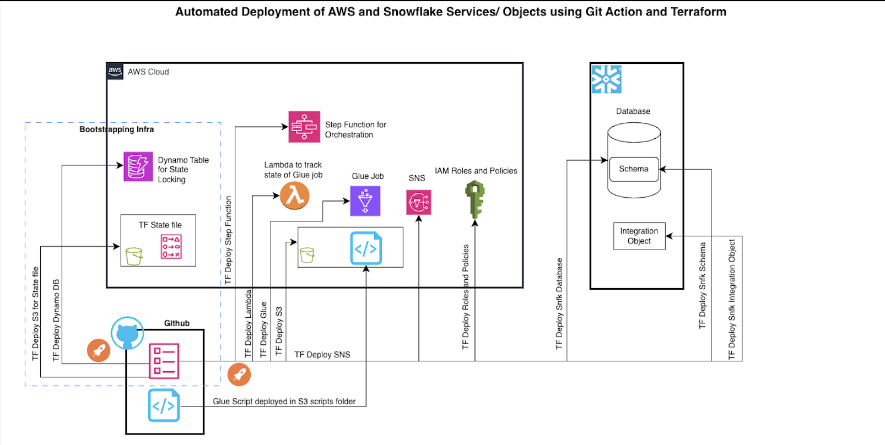
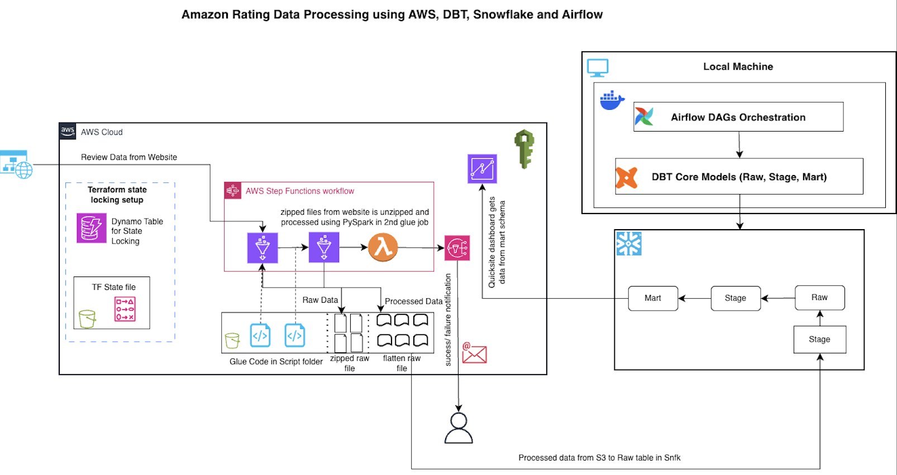

# Capstone Project — Amazon Review

## [Project Overview](./setup.md)

This **capstone project** focuses on building a **fully automated, end-to-end data engineering pipeline** that ingests, processes, and visualizes **Amazon Product Review Data**.

The dataset used in this project can be downloaded from the official **Amazon Review Data repository**:
🔗 [https://nijianmo.github.io/amazon](https://nijianmo.github.io/amazon/#:~:text=Amazon%20Fashion,%28186%2C637%20products%29)

It includes both **review** and **metadata** JSON files for multiple product categories (e.g., Electronics, Fashion, Home, etc.).

Students will use **AWS services** (`Glue`, `Step Functions`, `Lambda`, `S3`, `SNS`, `IAM`, `QuickSight`), along with **Snowflake**, **DBT**, **Airflow**, and **Terraform** for Infrastructure as Code (IaC).
**GitHub Actions** automates the entire provisioning, orchestration, and CI/CD process.

### By the end of this project, students will have a fully functional platform that can:

* Ingest and process **Amazon Review and Metadata JSON files**
* Load structured data into **Snowflake**
* Transform and aggregate data using **DBT**
* Orchestrate workflows through **Airflow**
* Visualize metrics like **average ratings by brand and year** in **QuickSight**

---

## **Phase 1 - Infrastructure**

In this phase, students will automate the deployment of **AWS and Snowflake components** using **Terraform**, managed via **GitHub Actions**.

### **Key Deliverables**

* **S3** bucket for storing raw and flattened data
* **DynamoDB** table for Terraform state locking
* **IAM Roles and Policies** for service-level access
* **Glue**, **Lambda**, **SNS**, and **Step Functions** setup via Terraform
* **Snowflake objects** — Database, Schema, and Warehouse creation
* **GitHub Actions workflow** for automated Terraform provisioning

---

### [Workflow](./github-workflow.md)

1. Developer pushes Terraform code to GitHub
2. **GitHub Actions** runs `terraform plan` and `terraform apply`
3. AWS and Snowflake resources are provisioned automatically
4. Terraform state and locks are stored in **S3** and **DynamoDB**

---

### [Architecture](./infra-readme.md)

**Automated Deployment using GitHub Actions and Terraform**

---

## **Phase 2 — Amazon Review Data Pipeline**

After infrastructure setup, students will create a **data pipeline** to process **Amazon Product Review and Metadata JSON files** using **AWS Glue**, **Step Functions**, and **Snowflake**.

---

### **Source Details**

| Parameter        | Description                                                                                                                 |
| ---------------- | --------------------------------------------------------------------------------------------------------------------------- |
| **Dataset**      | Amazon Product Reviews (public dataset)                                                                                     |
| **Download URL** | [https://nijianmo.github.io/amazon](https://nijianmo.github.io/amazon/#:~:text=Amazon%20Fashion,%28186%2C637%20products%29) |
| **Format**       | JSON                                                                                                                        |
| **Purpose**      | Analyze product performance and customer sentiment by brand and year                                                        |
| **Frequency**    | Daily (new reviews periodically added)                                                                                      |

---

### **Flow Summary**

1. **Glue Download Job** — Extracts review and metadata JSON files and stores them in **S3 (Raw Zone)**
2. **Glue Flatten Job** — Parses, flattens, and writes structured output to **S3 (Flattened Zone)** and **Snowflake RAW tables**
3. **Step Function** — Orchestrates both Glue jobs sequentially (`Download → Flatten`)
4. **Lambda Function** — Sends job status notifications via **SNS**
5. **DBT Models** — Transform the flattened data within **Snowflake** into clean analytical tables
6. **Airflow DAG** — Automates dbt runs, tests, and documentation generation
7. **QuickSight Dashboard** — Visualizes key insights such as **average rating trends per brand per year**

---

### [Architecture](./transform-readme.md)

**Amazon Review Data Processing using AWS, DBT, Snowflake, and Airflow**

---