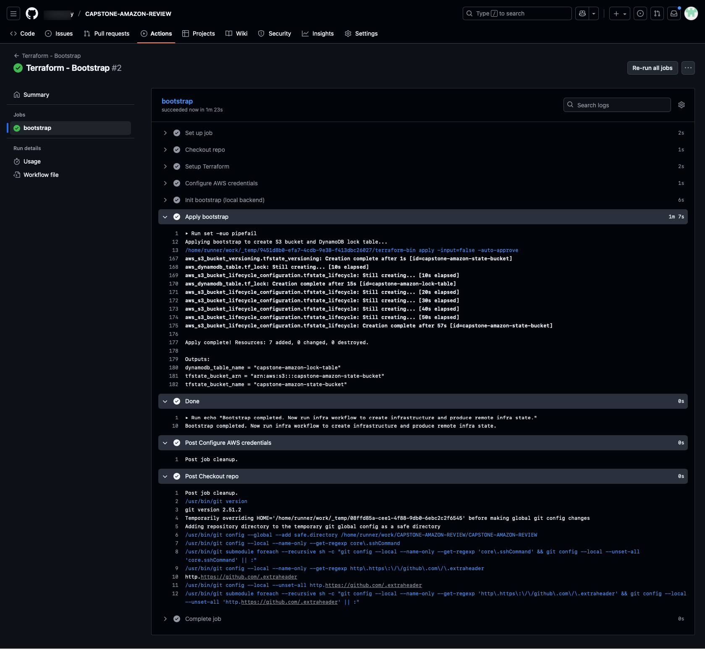
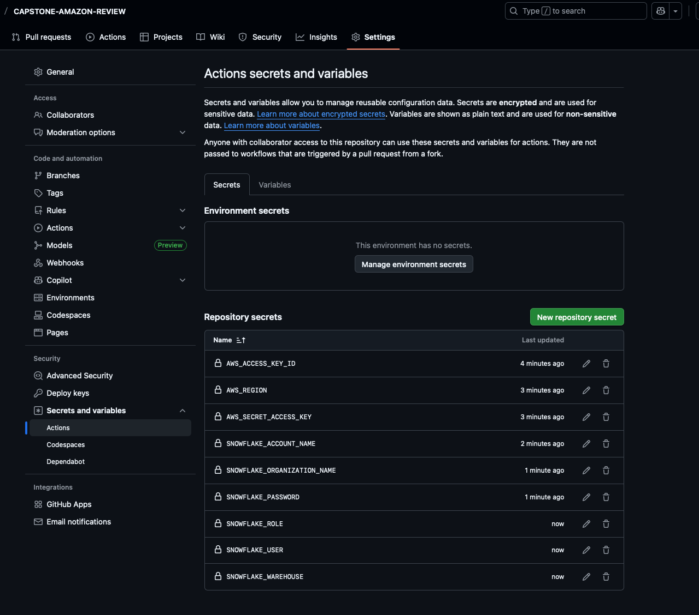
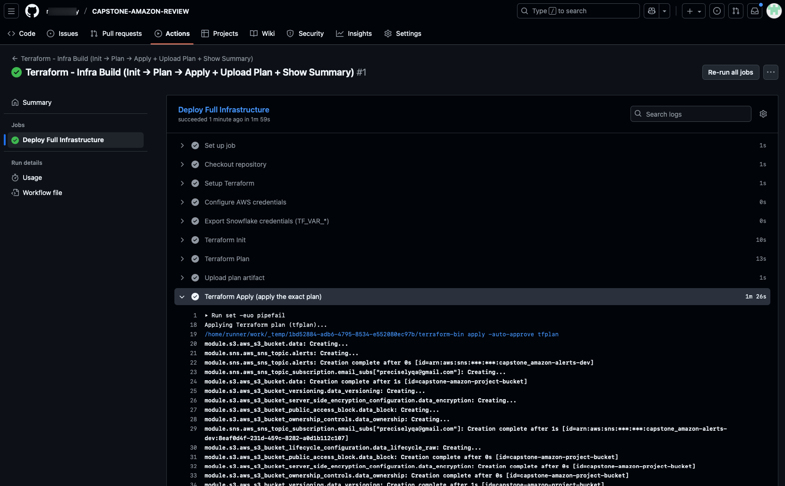
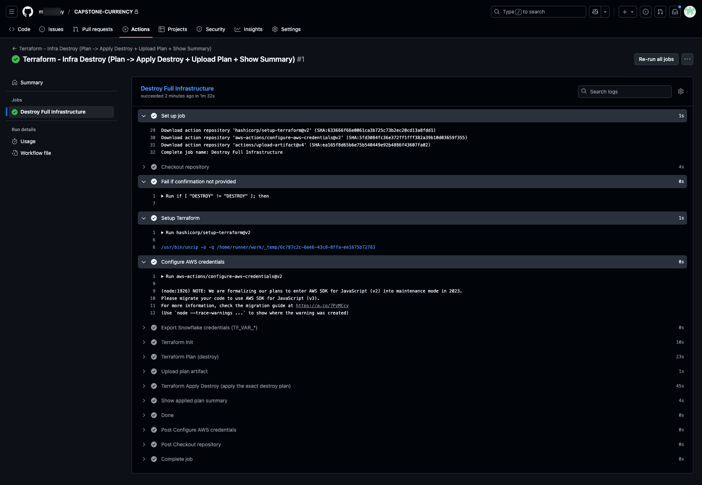

# .github Overview

**Purpose:** CI workflows to bootstrap Terraform backend, deploy the full infrastructure, and safely destroy infrastructure. Each workflow runs on-demand (`workflow_dispatch`) so you control when infra changes are made.

---

### `Terraform - Bootstrap`

**Trigger:** `workflow_dispatch`
**Purpose:** initialize and apply the `infra/bootstrap` module using a local backend so it can create the S3 state bucket and DynamoDB lock table.
**Key steps (summary):

* Checkout repo
* Setup Terraform (1.5.7)
* Configure AWS credentials (from secrets)
* `terraform init` in `infra/bootstrap` with `-backend=false`
* `terraform apply` in `infra/bootstrap`

**Required secrets / env used:**

* `AWS_ACCESS_KEY_ID`
* `AWS_SECRET_ACCESS_KEY`
* `AWS_REGION`

**Notes:** this run uses a local backend to create the remote backend resources. After this completes, run the infra build workflow to initialize the S3 backend and continue.

---

### `Terraform - Infra Build`

**Trigger:** `workflow_dispatch`
**Purpose:** initialize the root `infra` module (reconfigure backend), create a plan artifact, upload it, and apply the exact plan to build the full infrastructure.
**Key steps (summary):**

* Checkout repo
* Setup Terraform (1.5.7)
* Configure AWS credentials (from secrets)
* Export Snowflake credentials into `GITHUB_ENV` as `TF_VAR_*` (from secrets)
* `terraform init -reconfigure` in `infra` (uses S3 backend created by bootstrap)
* `terraform plan -out=tfplan` and `terraform show` → `plan.txt`
* Upload plan artifact (`infra/tfplan`, `infra/plan.txt`)
* `terraform apply tfplan` (apply exact plan)
* `terraform show -no-color tfplan` (summary)

**Required secrets / env used:**

* `AWS_ACCESS_KEY_ID`
* `AWS_SECRET_ACCESS_KEY`
* `AWS_REGION`
* `SNOWFLAKE_ORGANIZATION_NAME`
* `SNOWFLAKE_ACCOUNT_NAME`
* `SNOWFLAKE_USER`
* `SNOWFLAKE_PASSWORD`
* `SNOWFLAKE_ROLE`
* `SNOWFLAKE_WAREHOUSE`

---

---

**Notes:** plan artifact is uploaded to GitHub Actions artifacts for review/audit. Backend relies on S3 bucket and DynamoDB table created by bootstrap.

---

---

### `Terraform - Infra Destroy (Plan -> Apply Destroy + Upload Plan + Show Summary)`

**Trigger:** `workflow_dispatch` with inputs: `confirm` (must equal `DESTROY`) and optional `auto_approve`
**Purpose:** create a destroy plan, upload it, and apply it to tear down the infra. Includes a manual confirmation guard to avoid accidental runs.
**Key steps (summary):**

* Checkout repo
* Require `confirm` input equals `DESTROY` (fails otherwise)
* Setup Terraform (1.5.7)
* Configure AWS credentials (from secrets)
* Export Snowflake credentials into `GITHUB_ENV` as `TF_VAR_*`
* `terraform init -reconfigure` in `infra`
* `terraform plan -destroy -out=tfplan` and `terraform show` → `plan.txt`
* Upload destroy plan artifact (`infra/tfplan`, `infra/plan.txt`)
* `terraform apply -auto-approve tfplan` (applies destroy plan)
* `terraform show -no-color tfplan` (summary)

**Required secrets / env used:** same Snowflake + AWS secrets as infra build.

**Notes:** This workflow uses a `concurrency` group to limit parallel destroy runs and requires the explicit `DESTROY` token to proceed.

---

## Common notes / recommendations

* Ensure the **bootstrap** workflow is run first (once) to create the S3 bucket and DynamoDB lock table referenced by the `infra/backend.tf`.
* Keep secrets in GitHub Actions Secrets and never commit them to source.
* The workflows use Terraform `1.5.7` and `hashicorp/setup-terraform@v2` — update versions in workflows when you upgrade Terraform.
* Plan artifacts (`tfplan`, `plan.txt`) are uploaded for audit — download and inspect before applying in sensitive environments.
---
**[Back](./README.md)**
