# Infrastructure Overview

The **`infra/`** directory defines the complete, automated infrastructure for the **Capstone Currency Data Pipeline**, using **Terraform** to provision and orchestrate both **AWS** and **Snowflake** resources.

It establishes a modular, production-grade foundation for **data ingestion**, **processing**, **notification**, and **analytics integration**, following best practices for separation of concerns and environment consistency.

---

### Core Objective

Provision all infrastructure components required for the **end-to-end data pipeline** that:

1. **Ingests currency exchange data** from external APIs via AWS Glue.
2. **Orchestrates workflow execution** using AWS Step Functions and SNS.
3. **Triggers downstream tasks** via Lambda notifications.
4. **Stores and analyzes data** in Snowflake using a secure AWS–Snowflake integration.

---

## Top-level structure

```
├── backend.tf
├── bootstrap
│   ├── backend.tf
│   ├── main.tf
│   ├── outputs.tf
│   ├── terraform.tfstate
│   └── variables.tf
├── errored.tfstate
├── glue
│   ├── glue.tf
│   ├── output.tf
│   ├── scripts
│   │   ├── Capstone-Amazon-Review-Dataset-Download-Job.py
│   │   └── Capstone-Amazon-Review-Flatten-Job.py
│   └── variables.tf
├── iam
│   ├── glue_role.tf
│   ├── lambda_role.tf
│   ├── outputs.tf
│   ├── sfn_role.tf
│   └── variables.tf
├── lambda
│   ├── deploy
│   │   ├── handler.py
│   │   └── lambda_package.zip
│   ├── lambda.tf
│   └── variables.tf
├── main.tf
├── providers.tf
├── s3
│   ├── main.tf
│   ├── outputs.tf
│   └── variables.tf
├── snowflake
│   ├── main.tf
│   ├── outputs.tf
│   └── variables.tf
├── snowflake_integration
│   ├── main.tf
│   ├── outputs.tf
│   ├── scripts
│   │   └── update_trust.py
│   └── variables.tf
├── sns
│   ├── main.tf
│   └── variables.tf
├── stepfunctions
│   ├── sfn.tf
│   └── variables.tf
├── subscriptions.tf
└── variables.tf

```

---

## Module breakdown — purpose, typical resources, inputs & outputs


## [bootstrap/](./infra/bootstrap/)

Purpose: create foundational Terraform backend resources used by the rest of the infra (S3 bucket for tfstate, DynamoDB table for state locking).

Files:

* `backend.tf` — defines local backend configuration for storing Terraform state.
* `main.tf` — provisions S3 bucket, applies security and lifecycle settings, and creates DynamoDB lock table.
* `outputs.tf` — exposes S3 bucket and DynamoDB table names and ARNs as outputs.
* `variables.tf` — declares input variables for AWS region, state bucket name (unique), and DynamoDB table name.

Typical resources:

* `aws_s3_bucket.tfstate`
* `aws_s3_bucket_public_access_block.tfstate_block`
* `aws_s3_bucket_ownership_controls.tfstate_ownership`
* `aws_s3_bucket_versioning.tfstate_versioning`
* `aws_s3_bucket_server_side_encryption_configuration.tfstate_encryption`
* `aws_s3_bucket_lifecycle_configuration.tfstate_lifecycle`
* `aws_dynamodb_table.tf_lock`

Inputs:

| Name                     |     Type | Description                           |
| ------------------------ | -------: | ------------------------------------- |
| `aws_region`             | `string` | AWS region for backend resources      |
| `tfstate_bucket_name`    | `string` | Bucket name for Terraform state       |
| `tfstate_dynamodb_table` | `string` | DynamoDB table name for state locking |

Outputs:

| Name                  | Description                           |
| --------------------- | ------------------------------------- |
| `tfstate_bucket_name` | S3 bucket name for Terraform state    |
| `tfstate_bucket_arn`  | ARN of the Terraform state bucket     |
| `dynamodb_table_name` | DynamoDB table name for state locking |

> Note: `terraform.tfstate` should be ignored in local — use remote backend as the source of truth.

**Bucket:**

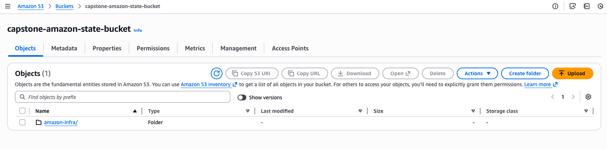

**DynamoDB:**

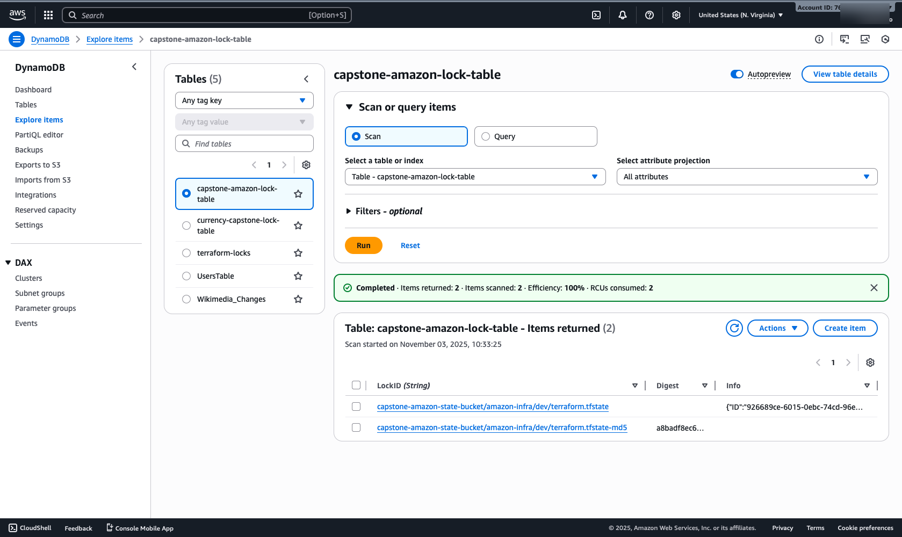

---

## [s3/](./infra/s3/)

**Purpose:**
Create a secure, versioned, and encrypted **Amazon S3 data bucket** for the **Capstone Amazon Review** project, with structured prefixes for raw, processed, and intermediate data.
The module enforces best practices for **access control, encryption, ownership, and lifecycle management**.

---

## Files in this module

| File           | Purpose                                                                                                   |
| -------------- | --------------------------------------------------------------------------------------------------------- |
| `main.tf`      | Provisions the S3 bucket and associated configurations (access block, versioning, encryption, lifecycle). |
| `variables.tf` | Defines all input variables with defaults for region, environment, and retention policies.                |
| `outputs.tf`   | Exports key outputs such as bucket name, ARN, and prefixes for downstream modules.                        |

---

## Provisioned Resources

This module provisions the following AWS resources (all using AWS Provider v5+ syntax):

| Resource                                                             | Description                                               |
| -------------------------------------------------------------------- | --------------------------------------------------------- |
| `aws_s3_bucket.data`                                                 | Core S3 bucket resource.                                  |
| `aws_s3_bucket_public_access_block.data_block`                       | Denies all forms of public access.                        |
| `aws_s3_bucket_ownership_controls.data_ownership`                    | Enforces `BucketOwnerEnforced` to disable ACLs.           |
| `aws_s3_bucket_versioning.data_versioning`                           | Enables object versioning for recoverability.             |
| `aws_s3_bucket_server_side_encryption_configuration.data_encryption` | Configures default SSE-S3 encryption using AES256.        |
| `aws_s3_bucket_lifecycle_configuration.data_lifecycle_raw`           | Defines lifecycle management rules for the `raw/` prefix. |

---

## Behavior and Features

**Security Controls**

* Public access fully blocked.
* Ownership enforced (`BucketOwnerEnforced`) — disables ACLs.
* Default encryption enabled using **SSE-S3 (AES256)**.

**Versioning**

* All object versions are preserved until lifecycle expiration.

**Lifecycle Management (for `raw/` prefix)**

* Current objects transition to `STANDARD_IA` after *30 days*.
* Current objects expire after *365 days*.
* Noncurrent versions transition to `STANDARD_IA` after *90 days*.
* Noncurrent versions expire after *365 days*.

**Tagging**
Every bucket is tagged with:

```
Name      = <bucket_name>
Project   = capstone-amazon-review
Env       = <env>
ManagedBy = terraform
```

---

## Local Prefixes

The module defines reusable canonical prefixes for consistent folder organization:

| Prefix Key  | Path         | Usage                                     |
| ----------- | ------------ | ----------------------------------------- |
| `raw`       | `raw/`       | Source-of-truth data (raw ingested files) |
| `scripts`   | `scripts/`   | Glue or ETL job scripts                   |
| `tmp`       | `tmp/`       | Temporary/intermediate storage            |
| `flattened` | `flattened/` | Flattened/processed datasets              |

Exported as a map in `s3_prefixes` output.

---

## Inputs

| Name                  | Type     | Default                    | Description                                         |
| --------------------- | -------- | -------------------------- | --------------------------------------------------- |
| `aws_region`          | `string` | `"us-east-1"`              | AWS region for deployment.                          |
| `project`             | `string` | `"capstone-amazon-review"` | Project name for tagging.                           |
| `env`                 | `string` | `"dev"`                    | Environment name (dev/staging/prod).                |
| `bucket_name`         | `string` | *(required)*               | Globally unique S3 bucket name.                     |
| `force_destroy`       | `bool`   | `true`                     | Allow force deletion even when non-empty (dev use). |
| `raw_transition_days` | `number` | `30`                       | Days before raw objects move to STANDARD_IA.        |
| `noncurrent_days`     | `number` | `90`                       | Days before old versions move to STANDARD_IA.       |
| `raw_expiration_days` | `number` | `365`                      | Days before raw objects expire.                     |

---

## Outputs

| Name          | Description                                                        |
| ------------- | ------------------------------------------------------------------ |
| `bucket_name` | Name of the created S3 bucket.                                     |
| `bucket_arn`  | ARN of the created S3 bucket.                                      |
| `s3_prefixes` | Map of common prefixes (`raw/`, `scripts/`, `tmp/`, `flattened/`). |

---

## Example Usage

```hcl
module "data_bucket" {
  source       = "./infra/s3"

  bucket_name  = "capstone-amazon-review-data-bucket"
  aws_region   = "us-east-1"
  project      = "capstone-amazon-review"
  env          = "dev"
  force_destroy = true

  # Optional overrides for lifecycle settings
  raw_transition_days = 15
  noncurrent_days     = 60
  raw_expiration_days = 365
}
```

---

## Lifecycle Rule Summary

| Rule ID               | Prefix | Transition                | Expiration            | Noncurrent Transition     | Noncurrent Expiration |
| --------------------- | ------ | ------------------------- | --------------------- | ------------------------- | --------------------- |
| `raw-current-tiering` | `raw/` | STANDARD_IA after 30 days | Delete after 365 days | STANDARD_IA after 90 days | Delete after 365 days |

---

## Security & Operational Guidance

| Environment      | Recommended Setting     | Notes                                   |
| ---------------- | ----------------------- | --------------------------------------- |
| **Dev/Test**     | `force_destroy = true`  | Allows cleanup without manual emptying. |
| **Staging/Prod** | `force_destroy = false` | Prevents accidental data loss.          |

**Additional Recommendations:**

* For **sensitive datasets**, use **SSE-KMS** instead of AES256 (extend this module with a `kms_key_arn` variable).
* Avoid uploading directly to the bucket; use controlled AWS Glue or Lambda processes.
* Reference `module.data_bucket.s3_prefixes["raw"]` etc., instead of hardcoding paths.

---

**Bucket Folder Layout**

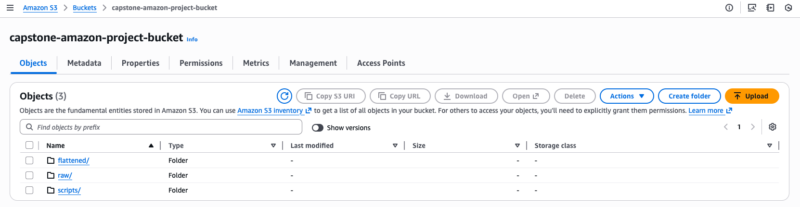

---

**Bucket arn**

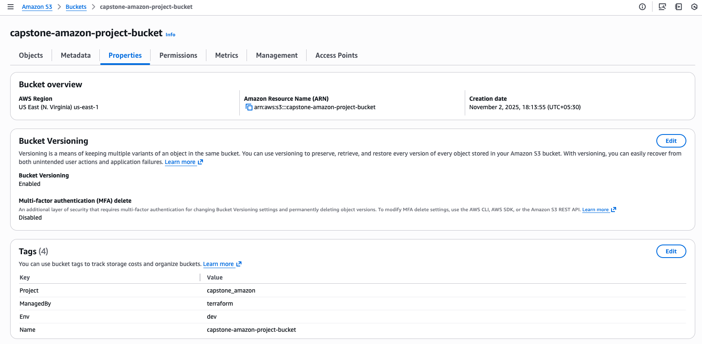

---

## [iam/](./infra/iam/)

**Purpose:**
Create IAM roles, policies, and attachments for **Glue**, **Lambda**, and **Step Functions** in the **Capstone Amazon Review** project.
Each role is scoped with least-privilege access to S3, CloudWatch, SNS, and other AWS services required by the data pipeline.

---

## Files in this module

| File             | Purpose                                                                                                          |
| ---------------- | ---------------------------------------------------------------------------------------------------------------- |
| `glue_role.tf`   | Defines Glue assume role, S3 access policy, CloudWatch Logs policy, and attachments.                             |
| `lambda_role.tf` | Defines Lambda assume role, attaches basic execution policy, and adds inline SSM/SNS/SecretsManager permissions. |
| `sfn_role.tf`    | Defines Step Functions assume role, and policies to start/poll Glue jobs, invoke Lambda, and publish to SNS.     |
| `variables.tf`   | Declares module inputs (project, env, s3_bucket_arn, lambda_function_arn, glue_job_name, allow_pass_role).       |
| `outputs.tf`     | Exports role ARNs for downstream use.                                                                            |

---

## Typical resources

* `data.aws_iam_policy_document.glue_assume`
* `aws_iam_role.glue_role`
* `aws_iam_policy.glue_s3_policy`
* `aws_iam_role_policy_attachment.glue_attach_s3`
* `aws_iam_policy.glue_logs`
* `aws_iam_role_policy_attachment.glue_attach_logs`
* `data.aws_iam_policy_document.lambda_assume`
* `aws_iam_role.lambda_role`
* `aws_iam_role_policy_attachment.lambda_basic_exec`
* `aws_iam_policy.lambda_extra`
* `aws_iam_role_policy_attachment.lambda_extra_attach`
* `data.aws_iam_policy_document.sfn_assume`
* `aws_iam_role.sfn_role`
* `aws_iam_policy.sfn_policy`
* `aws_iam_role_policy_attachment.sfn_attach_policy`
* `data.aws_caller_identity.current`
* `data.aws_region.current`

---

## Roles and Permissions

### Glue Role

* **Trust:** `glue.amazonaws.com`
* **S3 Access:**

  * `s3:ListBucket` (limited to prefixes: `scripts/*`, `raw/*`, `tmp/*`, `flattened/*`)
  * `s3:GetObject`, `s3:PutObject`, `s3:DeleteObject`, `s3:GetObjectVersion`
* **Logs:** CloudWatch Logs permissions for job output.
* **Managed Policy:** `AWSGlueServiceRole`
* **Tags:** `{ Project = "capstone-amazon-review", Env = var.env }`

---

### Lambda Role

* **Trust:** `lambda.amazonaws.com`
* **Managed Policy:** `AWSLambdaBasicExecutionRole`
* **Inline Policy:** access to

  * `ssm:GetParameter(s)`
  * `secretsmanager:GetSecretValue`
  * `sns:Publish`
* **Tags:** `{ Project = "capstone-amazon-review", Env = var.env }`

---

### Step Functions Role

* **Trust:** `states.amazonaws.com`
* **Inline Policy:**

  * `glue:StartJobRun`, `glue:GetJobRun`, `glue:GetJobRuns` (scoped to job ARN if `glue_job_name` provided)
  * `lambda:InvokeFunction` (scoped to `lambda_function_arn`)
  * `sns:Publish`
  * `logs:CreateLogStream`, `logs:PutLogEvents`
* **Optional:** `iam:PassRole` (enabled via `allow_pass_role = true`)

---

## Inputs

| Name                  | Type     | Default                    | Description                                                |
| --------------------- | -------- | -------------------------- | ---------------------------------------------------------- |
| `project`             | `string` | `"capstone-amazon-review"` | Project name used in naming and tags.                      |
| `env`                 | `string` | `"dev"`                    | Environment tag (dev/staging/prod).                        |
| `s3_bucket_arn`       | `string` | *(required)*               | ARN of the data S3 bucket.                                 |
| `lambda_function_arn` | `string` | `"*"`                      | ARN of Lambda for Step Functions invoke (use `*` for dev). |
| `glue_job_name`       | `string` | `""`                       | Glue job name for permission scoping (optional).           |
| `allow_pass_role`     | `bool`   | `false`                    | Enables Step Functions `iam:PassRole` permission.          |

---

## Outputs

| Name              | Description                         |
| ----------------- | ----------------------------------- |
| `glue_role_arn`   | ARN of the Glue IAM role.           |
| `lambda_role_arn` | ARN of the Lambda IAM role.         |
| `sfn_role_arn`    | ARN of the Step Functions IAM role. |

---

## Example usage

```hcl
module "iam" {
  source              = "./infra/iam"
  project             = "capstone-amazon-review"
  env                 = "dev"
  s3_bucket_arn       = module.s3.bucket_arn
  lambda_function_arn = aws_lambda_function.etl_runner.arn
  glue_job_name       = "capstone-amazon-glue-job"
  allow_pass_role     = false
}
```

---

## Security & Operational Guidance

| Environment  | Recommended Setting                    | Notes                                     |
| ------------ | -------------------------------------- | ----------------------------------------- |
| **Dev/Test** | Wildcards acceptable temporarily (`*`) | Easier for early setup, tighten later.    |
| **Prod**     | Explicit ARNs only                     | Avoid broad policies and wildcard access. |

**Best Practices:**

* Scope `lambda_function_arn`, SNS, and SecretsManager ARNs to exact resources before production.
* Use `allow_pass_role = false` unless Step Functions must pass IAM roles explicitly.
* Review and tighten CloudWatch Log resource ARNs where possible.

---

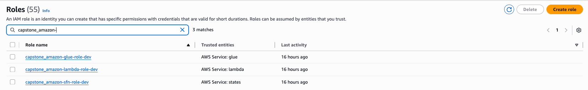

---

## [sns](./infra/sns/)

**Purpose:**
Create an **Amazon SNS topic** for Glue job and pipeline success/failure notifications, and optionally subscribe email recipients for alerts.

---

## Files in this module

| File           | Purpose                                                                         |
| -------------- | ------------------------------------------------------------------------------- |
| `main.tf`      | Defines the SNS topic, optional email subscriptions, and exports topic details. |
| `variables.tf` | Declares input variables for project, environment, and alert email list.        |
| `outputs.tf`   | Exports the topic name and ARN for downstream modules (Lambda, Step Functions). |

---

## Typical resources

* `aws_sns_topic.alerts`
* `aws_sns_topic_subscription.email_subs`

---

## Inputs

| Name           | Type           | Default                    | Description                                                         |
| -------------- | -------------- | -------------------------- | ------------------------------------------------------------------- |
| `project`      | `string`       | `"capstone-amazon-review"` | Project name used in SNS topic naming and tagging.                  |
| `env`          | `string`       | `"dev"`                    | Environment identifier (dev/staging/prod).                          |
| `alert_emails` | `list(string)` | `[]`                       | List of email addresses to subscribe (each must confirm via email). |

---

## Outputs

| Name             | Description                                      |
| ---------------- | ------------------------------------------------ |
| `sns_topic_name` | Name of the SNS topic for notifications.         |
| `sns_topic_arn`  | ARN of the SNS topic for downstream integration. |

---

## Example usage

```hcl
module "sns" {
  source       = "./infra/sns"
  project      = "capstone-amazon-review"
  env          = "dev"
  alert_emails = ["alerts@yourdomain.com", "admin@yourdomain.com"]
}
```

---

## Behavior and Notes

**Automatic Topic Creation**
Creates a unique SNS topic named `<project>-alerts-<env>`.

**Optional Email Subscriptions**
Subscribes all emails provided in `alert_emails`; each recipient must **confirm** the subscription manually.

**Integration Ready**
Outputs the SNS topic ARN for downstream use by:

* **Lambda module** — to receive event notifications.
* **Step Functions module** — to publish job success/failure messages.

---

## Security & Operations

| Area                    | Recommendation                                                                           |
| ----------------------- | ---------------------------------------------------------------------------------------- |
| **Email Confirmations** | Ensure each recipient confirms subscription via the AWS verification email.              |
| **Topic Policies**      | For production, restrict who can publish messages (e.g., only Step Functions or Lambda). |
| **Tagging**             | Each resource inherits tags from `project` and `env` for cost tracking and governance.   |

---
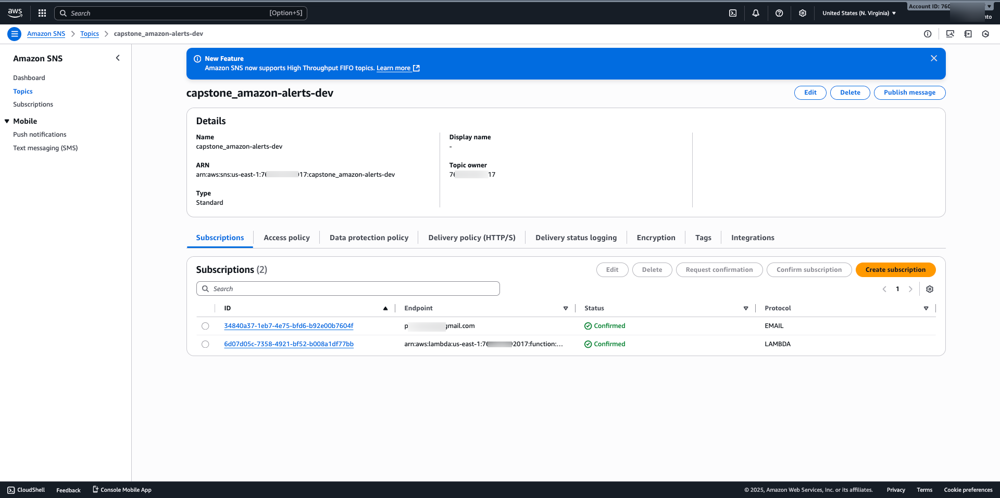

---

## [stepfunctions/](./infra/stepfunctions/)
**Purpose:**
Orchestrate the **Capstone Amazon Review** ETL pipeline by starting Glue jobs sequentially (Download → Flatten), waiting for completion, and invoking a Lambda function to publish structured success or failure notifications.

---

## Files in this module

| File           | Purpose                                                                                                                                    |
| -------------- | ------------------------------------------------------------------------------------------------------------------------------------------ |
| `sfn.tf`       | Defines the Step Functions state machine (JSON definition) and creates `aws_sfn_state_machine.orchestrator`.                               |
| `variables.tf` | Declares module inputs for project, environment, Glue job names, S3 bucket, IAM role, Lambda notification function, and optional settings. |

---

## Typical resources

* `local.state_machine_name`
* `aws_sfn_state_machine.orchestrator`

---

## State Machine Overview

The Step Function executes two AWS Glue jobs in sequence and sends a final notification via Lambda:

1. **RunDownloadJob** → starts the dataset download Glue job and waits synchronously.
2. **RunFlattenJob** → processes raw data into flattened Parquet outputs.
3. **NotifySuccess / NotifyFailure** → sends structured completion status to the notification Lambda.

The definition includes built-in error handling (`Catch` blocks) to route failed states to the failure notification path.

---

## Inputs

| Name                    | Type     | Default                    | Description                                                            |
| ----------------------- | -------- | -------------------------- | ---------------------------------------------------------------------- |
| `project`               | `string` | `"capstone-amazon-review"` | Project name used for tagging and resource naming.                     |
| `env`                   | `string` | `"dev"`                    | Environment name (dev/staging/prod).                                   |
| `bucket_name`           | `string` | *(required)*               | S3 bucket name used by the Glue jobs.                                  |
| `sfn_role_arn`          | `string` | *(required)*               | IAM role ARN used by Step Functions.                                   |
| `lambda_function_arn`   | `string` | *(required)*               | ARN of the Lambda function for success/failure notifications.          |
| `download_job_name`     | `string` | *(required)*               | Glue job name for the dataset download step.                           |
| `flatten_job_name`      | `string` | *(required)*               | Glue job name for the flattening/parquet conversion step.              |
| `sns_topic_arn`         | `string` | `""`                       | Optional SNS topic for notifications (not used in default definition). |
| `poll_interval_seconds` | `number` | `60`                       | Internal/documented polling interval for Glue job completion checks.   |

---

## Outputs

| Name       | Description                                                                           |
| ---------- | ------------------------------------------------------------------------------------- |
| `sfn_arn`  | ARN of the Step Functions state machine (`aws_sfn_state_machine.orchestrator.arn`).   |
| `sfn_name` | Name of the Step Functions state machine (`aws_sfn_state_machine.orchestrator.name`). |

---

## Example usage

```hcl
module "stepfunctions" {
  source              = "./infra/stepfunctions"
  project             = "capstone-amazon-review"
  env                 = "dev"

  bucket_name         = module.s3.bucket_name
  sfn_role_arn        = module.iam.sfn_role_arn
  lambda_function_arn = aws_lambda_function.notify.arn

  download_job_name   = "capstone-amazon-download-job"
  flatten_job_name    = "capstone-amazon-flatten-job"

  sns_topic_arn       = aws_sns_topic.notifications.arn
  poll_interval_seconds = 60
}
```

---

## State Machine Flow

**Flow:**

```
RunDownloadJob → RunFlattenJob → NotifySuccess
                     ↳ (on error) → NotifyFailure
```

Each Glue step runs synchronously (`arn:aws:states:::glue:startJobRun.sync`) to ensure sequential execution and state monitoring.

**Notifications:**
On completion, the Lambda function receives a structured payload such as:

```json
{
  "Project": "capstone-amazon-review",
  "Environment": "dev",
  "GlueJob": "capstone-amazon-flatten-job",
  "Status": "SUCCEEDED"
}
```

---

## Security & Operational Guidance

| Area              | Recommendation                                                                                      |
| ----------------- | --------------------------------------------------------------------------------------------------- |
| **IAM Role**      | Use a least-privilege Step Functions role (see `infra/iam` module).                                 |
| **Retries**       | For production, configure job-level retry strategies in Glue instead of increasing `max_attempts`.  |
| **Notifications** | Use the Lambda function or SNS topic for centralized pipeline monitoring.                           |
| **Logging**       | Enable CloudWatch Logs for state machine executions (via console or additional Terraform settings). |

---

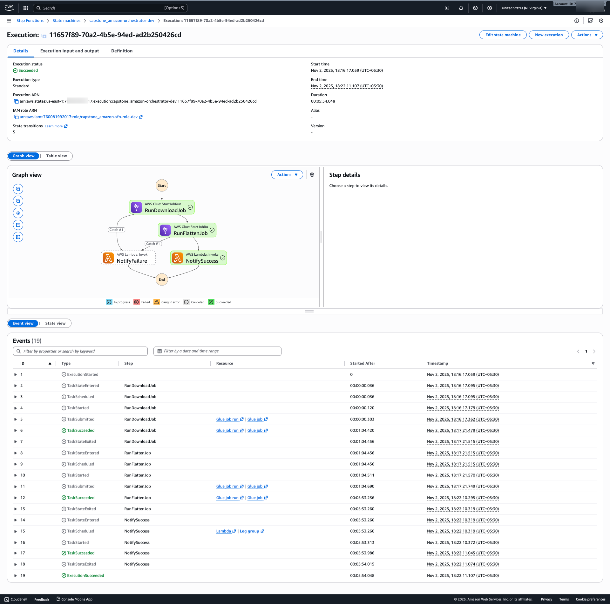

---

## [snowflake/](./infra/snowflake/)

**Purpose:**
Provision a **Snowflake database and schema** for the **Capstone Amazon Review** project, using the official Snowflake Terraform provider.
This module centralizes database/schema creation and optionally grants usage privileges to a specified role.

---

## Files in this module

| File           | Purpose                                                                                 |
| -------------- | --------------------------------------------------------------------------------------- |
| `main.tf`      | Declares Snowflake provider, defines resources for database and schema creation.        |
| `variables.tf` | Declares connection parameters, naming conventions, and optional grant configurations.  |
| `outputs.tf`   | Exports database, schema, and granted role outputs for reference in downstream modules. |

---

## Typical resources

* `snowflake_database.this`
* `snowflake_schema.this`

---

## Behavior and Features

**Automated Database and Schema Creation**

* Creates a Snowflake database and schema using project-derived naming (e.g. `capstone_amazon_review_db`, `capstone_amazon_review_schema`).

**Customizable Naming**

* Accepts explicit `database_name` and `schema_name` overrides.
* Falls back to values derived from `project_prefix` when not provided.

**Optional Role Granting**

* If `grant_role` is specified, the role is granted USAGE on both the database and schema.

**Provider-Scoped Authentication**

* Supports secure Snowflake authentication through environment variables or `.tfvars` files (best practice: use CI/CD secrets).

---

## Inputs

| Name                          | Type     | Default                                         | Description                                                   |
| ----------------------------- | -------- | ----------------------------------------------- | ------------------------------------------------------------- |
| `project_prefix`              | `string` | `"capstone_amazon_review"`                      | Prefix for deriving default DB/schema names.                  |
| `snowflake_organization_name` | `string` | *(required)*                                    | Snowflake organization name.                                  |
| `snowflake_account_name`      | `string` | *(required)*                                    | Snowflake account name within the organization.               |
| `snowflake_user`              | `string` | *(required)*                                    | Snowflake username used by Terraform.                         |
| `snowflake_password`          | `string` | *(required)*                                    | Password for the Snowflake user (sensitive).                  |
| `snowflake_role`              | `string` | `"SYSADMIN"`                                    | Role used for provisioning.                                   |
| `snowflake_warehouse`         | `string` | `"COMPUTE_WH"`                                  | Warehouse to use for operations.                              |
| `database_name`               | `string` | `""`                                            | Optional database name (defaults to `<project_prefix>_db`).   |
| `database_comment`            | `string` | `"Database for CAPSTONE-AMAZON-REVIEW project"` | Comment for the database.                                     |
| `schema_name`                 | `string` | `""`                                            | Optional schema name (defaults to `<project_prefix>_schema`). |
| `schema_comment`              | `string` | `"Schema for CAPSTONE-AMAZON-REVIEW project"`   | Comment for the schema.                                       |
| `grant_role`                  | `string` | `""`                                            | Optional Snowflake account role to grant USAGE privileges.    |

---

## Outputs

| Name                 | Description                                            |
| -------------------- | ------------------------------------------------------ |
| `snowflake_database` | Name of the created Snowflake database.                |
| `snowflake_schema`   | Name of the created Snowflake schema.                  |
| `granted_role`       | Role that received USAGE privileges (or null if none). |

---

## Example usage

```hcl
module "snowflake" {
  source = "./infra/snowflake"

  project_prefix              = "capstone_amazon_review"
  snowflake_organization_name = var.snowflake_organization_name
  snowflake_account_name      = var.snowflake_account_name
  snowflake_user              = var.snowflake_user
  snowflake_password          = var.snowflake_password
  snowflake_role              = "SYSADMIN"
  snowflake_warehouse         = "COMPUTE_WH"

  database_comment = "Database for CAPSTONE-AMAZON-REVIEW project"
  schema_comment   = "Schema for CAPSTONE-AMAZON-REVIEW project"
  grant_role       = "ANALYST_ROLE"
}
```

---

## Operational Notes

| Category               | Recommendation                                                                                 |
| ---------------------- | ---------------------------------------------------------------------------------------------- |
| **Security**           | Always use environment variables or GitHub Secrets for credentials. Never hardcode passwords.  |
| **Grants**             | Leave `grant_role` empty for private environments; specify a Snowflake role for shared access. |
| **Naming**             | When omitted, names follow the convention `<project_prefix>_db` and `<project_prefix>_schema`. |
| **Terraform Provider** | Uses the `snowflakedb/snowflake` provider version `~> 0.100.0`.                                |

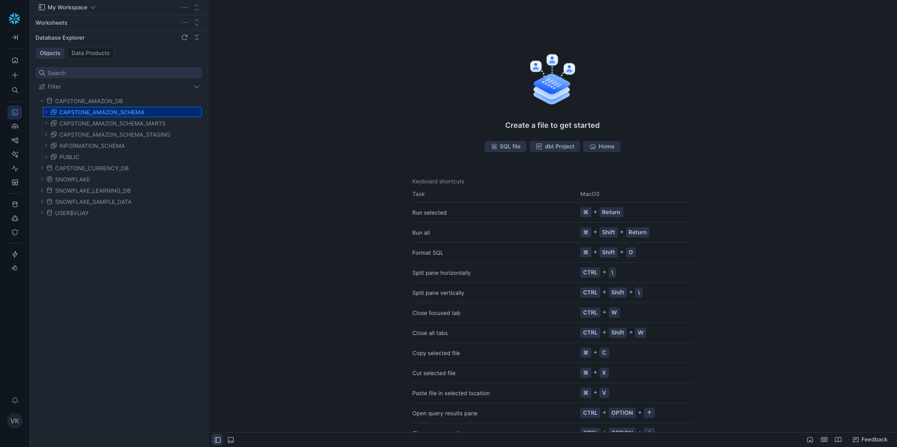

---

## [snowflake_integration/](./infra/snowflake_integration/)

**Purpose:**
Establish a secure connection between **Snowflake** and **Amazon S3** by creating an AWS IAM role and policy for Snowflake access, provisioning a **Snowflake storage integration**, and restricting the IAM role trust to the **Snowflake IAM principal and External ID**.

---

## Files in this module

| File                      | Purpose                                                                                                                                                                                                             |
| ------------------------- | ------------------------------------------------------------------------------------------------------------------------------------------------------------------------------------------------------------------- |
| `main.tf`                 | Creates the IAM role, S3 access policy, role-policy attachment, and Snowflake storage integration. Also includes a local-exec provisioner (`null_resource.tighten_trust`) to tighten IAM trust via a Python script. |
| `variables.tf`            | Declares module inputs such as S3 bucket/prefix, integration/role names, Snowflake AWS account ID, project name, and trust-update script path.                                                                      |
| `outputs.tf`              | Exports integration role ARN, allowed S3 path, and Snowflake-generated IAM user/external ID.                                                                                                                        |
| `scripts/update_trust.py` | Local helper script that updates the IAM assume-role-policy to restrict trust to Snowflake’s IAM user ARN and external ID.                                                                                          |

---

## Typical resources

* `data.aws_iam_policy_document.s3_read`
* `aws_iam_policy.snowflake_s3_read`
* `aws_iam_role.snowflake_integration`
* `aws_iam_role_policy_attachment.attach_read`
* `snowflake_storage_integration.capstone`
* `null_resource.tighten_trust`

---

## How it works

1. **S3 Access Policy** — Grants Snowflake permission to `ListBucket` and `GetObject` under a specific prefix.
2. **IAM Role** — Created with an initial permissive trust policy for Snowflake’s AWS account ID.
3. **Storage Integration** — Snowflake uses this IAM role to read data from S3 via a secure integration.
4. **Trust Tightening Script** — Once Snowflake generates its IAM user ARN and external ID, the Python script (`update_trust.py`) updates the IAM role’s trust policy to allow **only that specific principal + External ID**.

---

## Inputs

| Name                       | Type     | Default                                    | Description                                                           |
| -------------------------- | -------- | ------------------------------------------ | --------------------------------------------------------------------- |
| `s3_bucket`                | `string` | *(required)*                               | S3 bucket name for integration.                                       |
| `s3_prefix`                | `string` | `""`                                       | S3 key prefix Snowflake can access (e.g. `raw/`).                     |
| `integration_name`         | `string` | `"capstone_snowflake_s3_integration"`      | Snowflake storage integration name.                                   |
| `iam_role_name`            | `string` | `"capstone_snowflake_s3_integration_role"` | IAM role name for Snowflake to assume.                                |
| `snowflake_aws_account_id` | `string` | `"898466741470"`                           | Snowflake AWS account ID (region-specific; update for your account).  |
| `project`                  | `string` | `"capstone-amazon-review"`                 | Project tag/name for identification.                                  |
| `database_comment`         | `string` | `""`                                       | Optional comment for database association.                            |
| `schema_comment`           | `string` | `""`                                       | Optional comment for schema association.                              |
| `update_trust_script`      | `string` | `""`                                       | Path to the local `update_trust.py` script used to tighten IAM trust. |

> **Note:** You must update the IAM trust policy after the integration is created — the script automates this step using the Snowflake-generated IAM user ARN and External ID.

---

## Outputs

| Name                             | Description                                                  |
| -------------------------------- | ------------------------------------------------------------ |
| `snowflake_integration_role_arn` | ARN of the IAM role Snowflake assumes for S3 access.         |
| `s3_allowed_location`            | S3 path accessible to Snowflake (`s3://<bucket>/<prefix>`).  |
| `sf_storage_iam_user_arn`        | Snowflake-generated IAM user ARN after integration creation. |
| `sf_storage_external_id`         | Snowflake-generated External ID used for trust verification. |

---

## Example usage

```hcl
module "snowflake_integration" {
  source = "./infra/snowflake_integration"

  s3_bucket                = module.s3.bucket_name
  s3_prefix                = "raw/"
  project                  = "capstone-amazon-review"
  iam_role_name            = "capstone_snowflake_s3_integration_role"
  integration_name         = "capstone_snowflake_s3_integration"
  snowflake_aws_account_id = "898466741470" # verify for your region/account
  update_trust_script      = "${path.module}/scripts/update_trust.py"
}
```

---

## Trust Tightening (Security Enhancement)

After the Snowflake integration is created, the local script `update_trust.py` updates the IAM trust policy as follows:

**Before:**

```json
{
  "Effect": "Allow",
  "Principal": { "AWS": "arn:aws:iam::898466741470:root" },
  "Action": "sts:AssumeRole"
}
```

**After (restricted):**

```json
{
  "Effect": "Allow",
  "Principal": { "AWS": "arn:aws:iam::<snowflake_aws_account_id>:user/<snowflake_iam_user>" },
  "Action": "sts:AssumeRole",
  "Condition": { "StringEquals": { "sts:ExternalId": "<external_id>" } }
}
```

This ensures that **only Snowflake’s IAM user** with the correct **External ID** can assume the role.

---

## Security & Operational Guidance

| Area                     | Recommendation                                                                                                                                                                       |
| ------------------------ | ------------------------------------------------------------------------------------------------------------------------------------------------------------------------------------ |
| **IAM Permissions**      | The AWS credentials running Terraform must have `iam:UpdateAssumeRolePolicy` permissions for the script to work.                                                                     |
| **Snowflake Account ID** | Confirm the correct Snowflake AWS account ID for your region (refer to [Snowflake documentation](https://docs.snowflake.com/en/user-guide/data-load-s3-config-storage-integration)). |
| **S3 Access Scope**      | Restrict `s3_prefix` to the smallest path Snowflake requires (e.g., `raw/` instead of entire bucket).                                                                                |
| **Local Execution**      | The trust tightening script runs locally — ensure Python 3.8+ and `boto3` are installed in your environment.                                                                         |
| **Repeatability**        | If integration is recreated, rerun Terraform to refresh IAM trust with the new Snowflake identifiers.                                                                                |

---
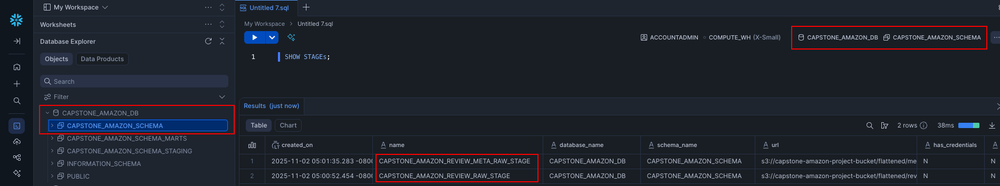

---

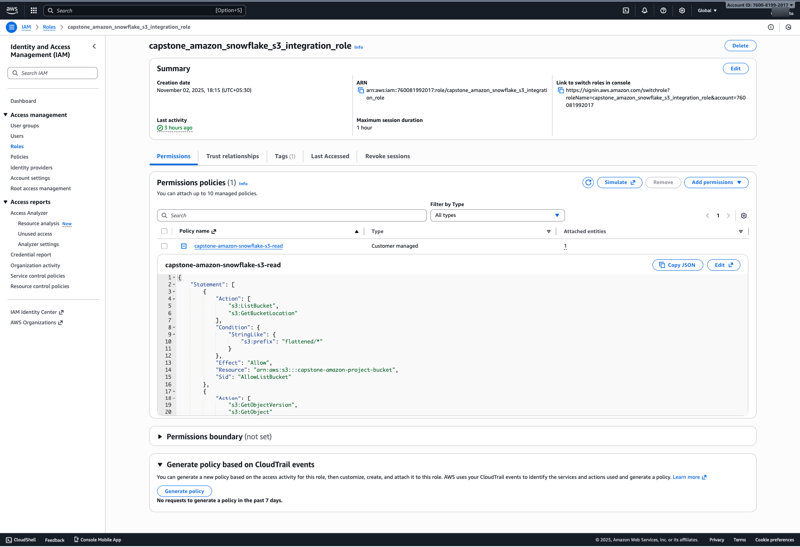

---

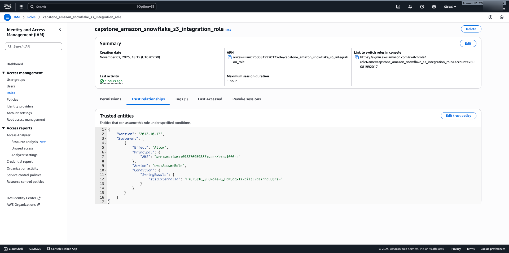

---

## [infra/](./infra/)

**Purpose:**
Orchestrate all Terraform submodules to provision the full Capstone Amazon Review stack: AWS infra (S3, IAM, Glue, Lambda, Step Functions, SNS) and Snowflake resources. Includes provider configuration and remote backend wiring.

---

## Files

| File               | Purpose                                                                        |
| ------------------ | ------------------------------------------------------------------------------ |
| `main.tf`          | Wire submodules together with explicit dependency ordering.                    |
| `providers.tf`     | AWS and Snowflake provider configuration.                                      |
| `subscriptions.tf` | SNS → Lambda subscription and `lambda:InvokeFunction` permission.              |
| `variables.tf`     | Global variables shared by submodules (project, env, region, Snowflake creds). |
| `backend.tf`       | Remote state backend (S3 + DynamoDB) configuration created by bootstrap.       |

---

## Typical modules (root references)

* `module.s3` — S3 data bucket (raw/scripts/tmp/flattened).
* `module.iam` — IAM roles & policies (Glue, Lambda, Step Functions).
* `module.glue` — Glue jobs and bootstrap scripts.
* `module.sns` — Alert topic and email subscriptions.
* `module.lambda` — Notification / post-ingest Lambda.
* `module.stepfunctions` — Orchestrator (Glue → Glue → Notify).
* `module.snowflake` — Snowflake DB & schema.
* `module.snowflake_integration` — Snowflake ↔ S3 storage integration.

---

## Inputs (selected)

| Name                          |           Type | Default                            | Notes                                       |
| ----------------------------- | -------------: | :--------------------------------- | ------------------------------------------- |
| `project`                     |       `string` | `"capstone_amazon"`                | Naming/tag prefix.                          |
| `env`                         |       `string` | `"dev"`                            | Environment.                                |
| `aws_region`                  |       `string` | `"us-east-1"`                      | AWS region.                                 |
| `data_bucket_name`            |       `string` | `"capstone-amazon-project-bucket"` | Primary S3 bucket (must be unique).         |
| `alert_emails`                | `list(string)` | `["preciselyqa@gmail.com"]`        | SNS email subscribers (confirm required).   |
| `snowflake_organization_name` |       `string` | `""`                               | Snowflake org (supply via secure vars).     |
| `snowflake_account_name`      |       `string` | `""`                               | Snowflake account/locator.                  |
| `snowflake_user`              |       `string` | `""`                               | Snowflake user for Terraform.               |
| `snowflake_password`          |       `string` | `""` (sensitive)                   | Supply via CI/CD secrets.                   |
| `snowflake_role`              |       `string` | `"ACCOUNTADMIN"`                   | Role used to provision Snowflake resources. |
| `snowflake_warehouse`         |       `string` | `"CAPSTONE_WH"`                    | Warehouse to use/create.                    |

---

## Backend (remote state)

* **Type:** `s3`
* **Bucket:** `capstone-amazon-state-bucket` (created via bootstrap)
* **Key:** `amazon-infra/dev/terraform.tfstate`
* **Region:** `us-east-1`
* **DynamoDB:** `capstone-amazon-lock-table` (state locking)
* **Encrypt:** `true`

> Ensure `infra/bootstrap` creates the S3 bucket + DynamoDB table before running root applies.

---

## Execution order & dependencies

Root `main.tf` wires modules with explicit `depends_on` to guarantee order, for example:

* `module.s3` → foundational.
* `module.iam` depends on `module.s3` (policies reference bucket ARN).
* `module.glue` depends on `module.iam` and `module.s3`.
* `module.lambda` depends on `module.iam` and `module.s3`.
* `module.stepfunctions` depends on Glue, Lambda, SNS, IAM.
* `module.snowflake` depends on S3 and IAM as required.
* `module.snowflake_integration` depends on S3, IAM, and Snowflake.

---

## SNS → Lambda wiring

Root creates:

* `aws_sns_topic_subscription` (protocol `lambda`) to connect topic → Lambda endpoint.
* `aws_lambda_permission` to allow SNS to invoke the Lambda.

---

## Security & operational notes

* Provide Snowflake credentials securely (CI secrets, TF Cloud variables, or environment variables).
* Replace placeholder bucket names and defaults with globally-unique values before `terraform init`.
* Use least-privilege ARNs in `module.iam` and set `allow_pass_role = false` by default.
* For prod: set `force_destroy = false` on S3 module and tighten all wildcard ARNs.
* Confirm Snowflake AWS account IDs and integration details when creating `snowflake_integration`.

---

## Example root usage (summary)

Run bootstrap to create backend resources, then:

```bash
terraform init
terraform plan -var-file=secrets.tfvars
terraform apply -var-file=secrets.tfvars
```

Provide sensitive values (Snowflake creds, unique bucket name) via `secrets.tfvars` or CI/CD secrets.

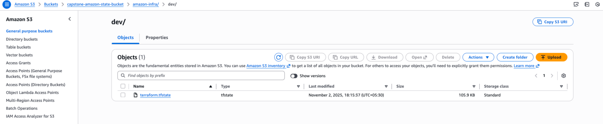

---
**[Back](./README.md)**
