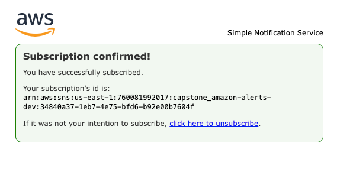
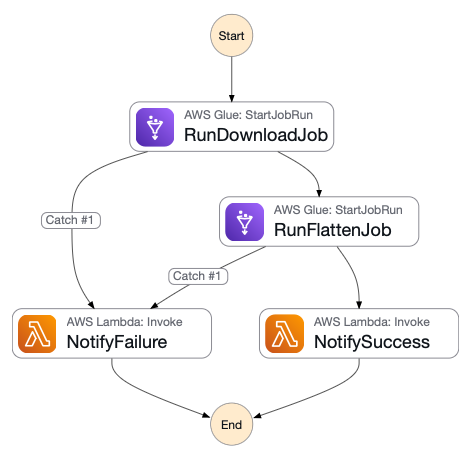
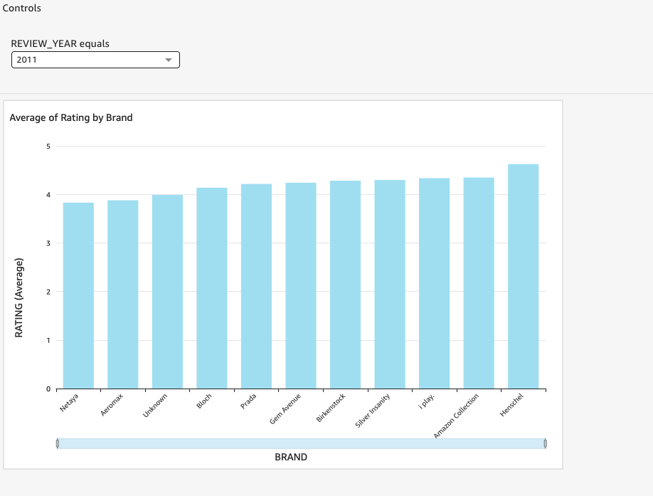

# Amazon Review Capstone — Fashion Category

End-to-end setup guide for the **Capstone Amazon Review (Fashion)** project.
All provisioning and orchestration are automated through **GitHub Actions CI** using **Terraform**.

---

## **1. Prerequisites**

Before triggering any workflow:

### **1.1 Dataset — Amazon Fashion Reviews**

Download both **Review** and **Metadata** JSON files for *Amazon Fashion* from the official Amazon Review Data repository:

🔗 [https://nijianmo.github.io/amazon](https://nijianmo.github.io/amazon/#:~:text=Amazon%20Fashion,%28186%2C637%20products%29)

| File                          | Description                                     |
| ----------------------------- | ----------------------------------------------- |
| `AMAZON_FASHION.json.gz`      | Customer reviews for fashion products           |
| `meta_AMAZON_FASHION.json.gz` | Product metadata (brand, title, features, etc.) |

After downloading:

1. Extract (`.gz`) files locally
2. Upload them to your Terraform-created S3 bucket under:

```
s3://capstone-amazon-project-bucket/raw/
```

---

### **1.2 AWS IAM User / Role**

Used by **GitHub Actions** for Terraform automation.

**Required permissions:**

* `AmazonS3FullAccess`
* `AWSGlueServiceRole`
* `AWSLambda_FullAccess`
* `AWSStepFunctionsFullAccess`
* `AmazonSNSFullAccess`
* `IAMFullAccess` *(for initial setup only)*

> Configure these credentials in your GitHub repository secrets as `AWS_ACCESS_KEY_ID` and `AWS_SECRET_ACCESS_KEY`.

---

### **1.3 Snowflake Account**

A **Snowflake trial or developer account** is required for data storage and dbt transformations.

Add these credentials as GitHub Secrets:

| Secret                        | Example Value     |
| ----------------------------- | ----------------- |
| `SNOWFLAKE_ORGANIZATION_NAME` | `myorg`           |
| `SNOWFLAKE_ACCOUNT_NAME`      | `xy12345`         |
| `SNOWFLAKE_USER`              | `capstone_user`   |
| `SNOWFLAKE_PASSWORD`          | `MySecurePass123` |
| `SNOWFLAKE_ROLE`              | `ACCOUNTADMIN`    |
| `SNOWFLAKE_WAREHOUSE`         | `CAPSTONE_WH`     |

---

## **2. CI Workflows**

All infrastructure setup and teardown are handled via **GitHub Actions** workflows under `.github/workflows/`.

| Workflow                    | Purpose                                                                                    | Trigger                    |
| --------------------------- | ------------------------------------------------------------------------------------------ | -------------------------- |
| **terraform-bootstrap.yml** | Creates Terraform backend (S3 bucket + DynamoDB table).                                    | Manual trigger (once).     |
| **terraform-infra.yml**     | Deploys complete AWS + Snowflake infrastructure (Glue, Lambda, SNS, Step Functions, etc.). | After bootstrap completes. |
| **terraform-destroy.yml**   | Destroys all provisioned resources.                                                        | Manual trigger.            |

---

## **3. AWS Side**

### **3.1 SNS Subscription (manual)**

After **[terraform-infra.yml](./.github/workflows/terraform-infra.yml)** completes, AWS sends a **subscription confirmation email** to the configured address.
Click **“Confirm subscription”** to activate notifications.

> This is the only manual AWS step.



---

### **3.2 Step Function → Glue Orchestration**

The Step Function automates the two **Glue ETL jobs**:
**Download Job → Flatten Job**

Example execution payload:

```json
{
  "workflow": "amazon_fashion_pipeline",
  "glue_jobs": [
    {
      "name": "capstone_amazon-download-job",
      "arguments": {
        "--SOURCE": "s3://capstone-amazon-project-bucket/raw/",
        "--CATEGORY": "Amazon Fashion",
        "--TYPE": "review",
        "--TempDir": "s3://capstone-amazon-project-bucket/temp/"
      }
    },
    {
      "name": "capstone_amazon-flatten-job",
      "arguments": {
        "--INPUT_PATH": "s3://capstone-amazon-project-bucket/raw/",
        "--OUTPUT_PATH": "s3://capstone-amazon-project-bucket/flattened/",
        "--CATEGORY": "Amazon Fashion",
        "--TempDir": "s3://capstone-amazon-project-bucket/temp/"
      }
    }
  ],
  "metadata": { "triggered_by": "manual" }
}
```



> Step Functions trigger the **Download** job first, followed by the **Flatten** job.
> SNS → Lambda sends real-time notifications for success or failure.

---

## **4. Snowflake Side**

If Snowflake integration must be recreated manually, use this SQL sequence:

```sql


DESC INTEGRATION "capstone_amazon_snowflake_s3_integration";

CREATE OR REPLACE FILE FORMAT CAPSTONE_AMAZON_PARQUET_REVIEW_FORMAT
  TYPE = PARQUET
  COMPRESSION = AUTO
  COMMENT = 'Parquet file format for Capstone raw flattened reviews';

CREATE OR REPLACE STAGE CAPSTONE_AMAZON_REVIEW_RAW_STAGE
  URL = 's3://capstone-amazon-project-bucket/raw/flattened/reviews/'
  STORAGE_INTEGRATION = "capstone_amazon_snowflake_s3_integration"
  FILE_FORMAT = CAPSTONE_AMAZON_PARQUET_REVIEW_FORMAT;


  LIST @capstone_amazon_review_raw_stage;


CREATE OR REPLACE EXTERNAL TABLE CAPSTONE_AMAZON_REVIEW_RAW_TABLE
USING TEMPLATE (
  SELECT ARRAY_AGG(OBJECT_CONSTRUCT(*))
  FROM TABLE(
    INFER_SCHEMA(
      LOCATION => '@CAPSTONE_AMAZON_REVIEW_RAW_STAGE',
      FILE_FORMAT => 'CAPSTONE_AMAZON_PARQUET_REVIEW_FORMAT'
    )
  )
)
WITH LOCATION = @CAPSTONE_AMAZON_REVIEW_RAW_STAGE
FILE_FORMAT = (FORMAT_NAME = 'CAPSTONE_AMAZON_PARQUET_REVIEW_FORMAT')
AUTO_REFRESH = FALSE;

```
```sql

DESC INTEGRATION "capstone_amazon_snowflake_s3_integration";

CREATE OR REPLACE FILE FORMAT CAPSTONE_AMAZON_PARQUET_REVIEW_META_FORMAT
  TYPE = PARQUET
  COMPRESSION = AUTO
  COMMENT = 'Parquet file format for Capstone raw flattened meta';

CREATE OR REPLACE STAGE CAPSTONE_AMAZON_REVIEW_META_RAW_STAGE
  URL = 's3://capstone-amazon-project-bucket/flattened/meta/'
  STORAGE_INTEGRATION = "capstone_amazon_snowflake_s3_integration"
  FILE_FORMAT = CAPSTONE_AMAZON_PARQUET_REVIEW_META_FORMAT;


LIST @capstone_amazon_review_meta_raw_stage;


CREATE OR REPLACE EXTERNAL TABLE CAPSTONE_AMAZON_REVIEW_META_RAW_TABLE
USING TEMPLATE (
  SELECT ARRAY_AGG(OBJECT_CONSTRUCT(*))
  FROM TABLE(
    INFER_SCHEMA(
      LOCATION => '@CAPSTONE_AMAZON_REVIEW_META_RAW_STAGE',
      FILE_FORMAT => 'CAPSTONE_AMAZON_PARQUET_REVIEW_META_FORMAT'
    )
  )
)
WITH LOCATION = @capstone_amazon_review_meta_raw_stage
FILE_FORMAT = (FORMAT_NAME = 'CAPSTONE_AMAZON_PARQUET_REVIEW_META_FORMAT')
AUTO_REFRESH = FALSE;
```

> This table allows dbt to directly read the flattened Amazon Fashion review data.

---

## **5. QuickSight — BI Integration**

Connect **Amazon QuickSight** to **Snowflake** to visualize rating and trend analytics.

---

### **5.1 Add Snowflake Dataset**

1. Open **QuickSight → Datasets → New dataset**

2. Choose **Snowflake**

3. Enter:

   * **Server:** `<your_snowflake_account>.snowflakecomputing.com`
   * **Warehouse**, **Database**, **Schema**
   * **Username**, **Password**

4. Click **Create data source → Select table → Save & visualize**


---

Got it — here’s the **simplified, clean version** of your QuickSight dashboard setup section (no color customization part, written in your README’s step-by-step documentation style):

---

### **5.2 Create an Interactive Dashboard — Top 10 Brands by Year (Amazon Fashion)**

1. Go to **Amazon QuickSight → Analyses → New analysis**

2. **Select dataset:** `MART_AVG_RATING_BY_YEAR_BRAND`

3. **Add a new visual:**

   * Click **Add → Add visual**
   * Choose **Vertical bar chart**

4. **Configure the visual:**

   * **X-axis** → `BRAND`
   * **Value** → `RATING (Average)`

5. **Add Top 10 filter:**

   * Click the ▼ menu beside `BRAND` in the **Field wells**
   * Choose **Add top/bottom filter**
   * Select **Top 10 by RATING (Average)`
   * Click **Apply**

6. **Add Year filter control:**

   * In the **Filters** panel, click **+ Add filter**
   * Choose **REVIEW_YEAR**
   * Click the **⋮ (three dots)** menu next to the filter name → **Add control**
   * Choose **Control type → Dropdown**
   * Click **Add**
   * The dropdown will appear above the chart for year selection

7. **Set display options:**

   * Under **Properties → Display settings**, change title to
     **“Top 10 Brands by Average Rating (Select Year)”**
   * Enable **Data labels**
   * Show **Legend** if required

8. **Save and publish:**

   * Click **Save → Save as**
   * Name it: `Amazon Fashion Ratings Dashboard`
   * Click **Share → Publish dashboard**

**Result:**
An interactive dashboard showing the **Top 10 brands by average rating** for the selected review year.




---

## **6. Execution Sequence Summary**

1. **Prepare prerequisites:**

   * Download **Amazon Fashion review and meta** JSON files
   * Upload to `s3://capstone-amazon-project-bucket/raw/`
   * Ensure AWS + Snowflake secrets are set

2. **In GitHub Actions:**

   * Run **terraform-bootstrap.yml**
   * Run **terraform-infra.yml**

3. Confirm the **SNS email subscription**

4. Trigger the **Step Function** manually (Download → Flatten → SNS notify)

5. **Snowflake** external table syncs new data

6. **Airflow DAG (`capstone_amazon_etl`)** runs dbt transformations (`stg_reviews`, `stg_meta`, `mart_avg_rating_by_year_brand`)

7. **QuickSight** dashboards visualize average ratings by brand and year

8. Run **terraform-destroy.yml** to clean up resources when done

---

## **8. Notes**

* Dataset: **Amazon Fashion reviews and metadata**
* Only **SNS confirmation** and **S3 upload** are manual.
* All credentials and parameters should be stored in **GitHub Secrets**.
* Ensure your S3 bucket matches Terraform outputs.
* QuickSight requires your Snowflake account to allow access from AWS public endpoints.
* Step Function payloads can be customized for different product categories.

---

**[Back](./README.md)**

---
