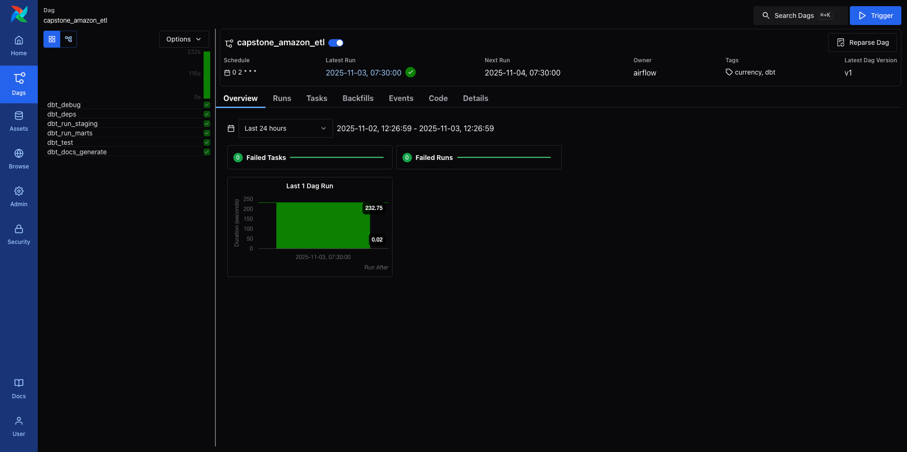
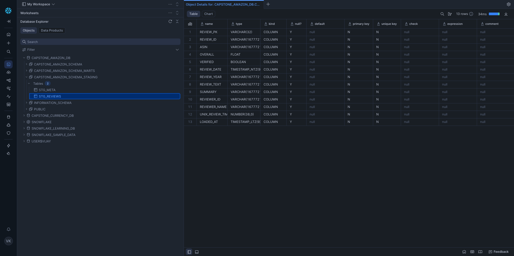
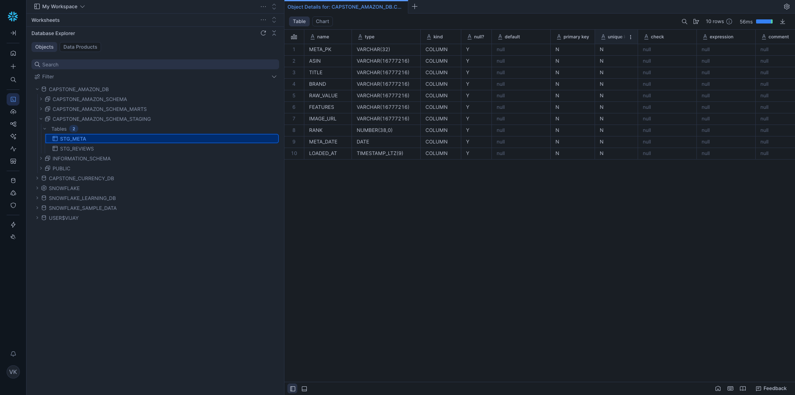
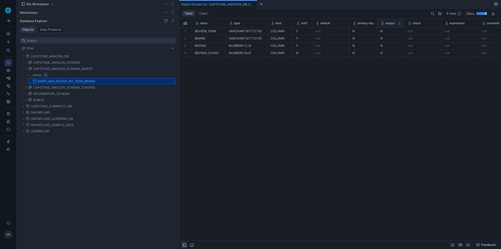

# **Capstone Amazon Review ETL Overview**

The **[`transform/`](./transform/)** directory defines the **data transformation and orchestration layer** of the **Capstone Amazon Review Data Pipeline**, combining:

* **dbt Core** for SQL-based transformations and modeling in **Snowflake**
* **Apache Airflow** for scheduling and orchestrating dbt runs in a containerized environment

This layer automates the journey from **raw JSON ingestion (via AWS Glue → Snowflake)** to **clean, analytics-ready marts**, enabling reproducible, version-controlled analytics.

---

## **Core Objective**

Automate and operationalize transformations by:

1. Connecting securely to **Snowflake** using `profiles.yml`.
2. Running **dbt transformations** via Airflow DAGs.
3. Enforcing **data quality tests** on every run.
4. Managing all components with a **Docker Compose** environment.
5. Delivering aggregated **brand and review analytics** for dashboards.

---

## **Folder Structure**

| Folder / File              | Purpose                                                         |
| -------------------------- | --------------------------------------------------------------- |
| **`capstone_amazon_etl/`** | dbt project containing SQL models, sources, tests, and configs. |
| **`dags/`**                | Airflow DAG definitions (runs dbt jobs on schedule).            |
| **`config/`**              | Airflow connection & environment configuration.                 |
| **`logs/`**                | Airflow task and scheduler logs.                                |
| **`plugins/`**             | Optional custom Airflow operators/hooks.                        |
| **`.env` / `.env_sample`** | Environment variables for Airflow and Snowflake credentials.    |
| **`docker-compose.yaml`**  | Spins up Airflow + dbt orchestration environment.               |

---

## **Airflow Orchestration**

The DAG orchestrates **dbt model execution** from staging → marts → testing → docs.

### DAG: [`amazon_dbt_dag.py`](./transform/dags/amazon_dbt_dag.py)

| Task                  | Description                                                        |
| --------------------- | ------------------------------------------------------------------ |
| **dbt_debug**         | Validate dbt configuration and Snowflake connection.               |
| **dbt_deps**          | Install dbt package dependencies.                                  |
| **dbt_run_staging**   | Run staging models (`stg_reviews`, `stg_meta`) to clean raw data.  |
| **dbt_run_marts**     | Run mart model (`mart_avg_rating_by_year_brand`) for aggregations. |
| **dbt_test**          | Run schema and data quality tests.                                 |
| **dbt_docs_generate** | Generate dbt documentation and lineage graph.                      |

**Schedule:** Daily at 02:00 (`0 2 * * *`)
**DAG ID:** `capstone_amazon_etl`

### DAG Snippet

```python
# capstone/airflow/dags/amazon_dbt_dag.py
from datetime import datetime, timedelta
import os

from airflow import DAG
from airflow.operators.bash import BashOperator
from airflow.models import Variable

# CONFIGURATION
DBT_PROJECT_DIR = Variable.get("DBT_PROJECT_DIR", "/opt/airflow/capstone_amazon_etl")
DBT_VENV_ACTIVATE = Variable.get("DBT_VENV_ACTIVATE", "")  # optional, usually empty in our docker setup
DBT_TARGET = Variable.get("DBT_TARGET", "dev")
SUMMARY_WINDOW_DAYS = Variable.get("SUMMARY_WINDOW_DAYS", "30")

default_args = {
    "owner": "airflow",
    "depends_on_past": False,
    "retries": 1,
    "retry_delay": timedelta(minutes=5),
}

with DAG(
    dag_id="capstone_amazon_etl",
    start_date=datetime(2025, 1, 1),
    schedule="0 2 * * *",  # daily at 02:00 (CRON) — use `schedule` not `schedule_interval`
    catchup=False,
    max_active_runs=1,
    default_args=default_args,
    tags=["dbt", "currency"],
) as dag:

    # optional: show dbt debug output (connectivity + profiles)
    dbt_debug = BashOperator(
        task_id="dbt_debug",
        bash_command=(
            f"cd {DBT_PROJECT_DIR} && "
            f"dbt debug --profiles-dir . --project-dir . --target {DBT_TARGET} || true"
        ),
        env=os.environ,
    )

    # install deps (if you use packages.yml in dbt; cheap if cached)
    dbt_deps = BashOperator(
        task_id="dbt_deps",
        bash_command=f"cd {DBT_PROJECT_DIR} && dbt deps --profiles-dir . --project-dir .",
        env=os.environ,
    )

    # run staging + core models
    dbt_run_staging = BashOperator(
        task_id="dbt_run_staging",
        bash_command=(
            f"cd {DBT_PROJECT_DIR} && "
            f"dbt run --profiles-dir . --project-dir . --target {DBT_TARGET} --select stg_reviews stg_meta "
            f"--vars '{{summary_window_days: {SUMMARY_WINDOW_DAYS}}}'"
        ),
        env=os.environ,
    )

    # run marts (trend + summary)
    dbt_run_marts = BashOperator(
        task_id="dbt_run_marts",
        bash_command=(
            f"cd {DBT_PROJECT_DIR} && "
            f"dbt run --profiles-dir . --project-dir . --target {DBT_TARGET} "
            f"--select mart_avg_rating_by_year_brand "
            f"--vars '{{summary_window_days: {SUMMARY_WINDOW_DAYS}}}'"
        ),
        env=os.environ,
    )

    # run tests
    dbt_test = BashOperator(
        task_id="dbt_test",
        bash_command=(
            f"cd {DBT_PROJECT_DIR} && "
            f"dbt test --profiles-dir . --project-dir . --target {DBT_TARGET} "
            f"--select schema"
        ),
        env=os.environ,
    )

    # generate docs (optional)
    dbt_docs = BashOperator(
        task_id="dbt_docs_generate",
        bash_command=f"cd {DBT_PROJECT_DIR} && dbt docs generate --profiles-dir . --project-dir .",
        env=os.environ,
    )

    # DAG order
    dbt_debug >> dbt_deps >> dbt_run_staging >> dbt_run_marts >> dbt_test >> dbt_docs
```

**Task Flow:**
`dbt_debug → dbt_deps → dbt_run_staging → dbt_run_marts → dbt_test → dbt_docs_generate`



---

## **DBT Project**

Located under **[`capstone_amazon_etl/`](./transform/capstone_amazon_etl/)**, this dbt project models raw Amazon product and review data into structured marts.

### Folder Structure

| Folder / File     | Purpose                                                                          |
| ----------------- | -------------------------------------------------------------------------------- |
| `.user.yml`       | Optional developer overrides for local dbt runs.                                 |
| `profiles.yml`    | Snowflake connection profile — account, user, warehouse, role, database, schema. |
| `dbt_project.yml` | Defines model paths, materializations, and variable defaults.                    |
| `models/`         | Core transformations: sources, staging, marts.                                   |

---

### **Model Architecture**

| Layer       | Purpose                                                          | Key Models / Files                                |
| ----------- | ---------------------------------------------------------------- | ------------------------------------------------- |
| **Sources** | Declare raw tables ingested by AWS Glue.                         | `sources/sources.yml`                             |
| **Staging** | Parse and normalize review + metadata JSON into structured form. | `staging/stg_reviews.sql`, `staging/stg_meta.sql` |
| **Marts**   | Aggregate and summarize data for analytics.                      | `marts/mart_avg_rating_by_year_brand.sql`         |

---

### **Connection Profile Example (`profiles_sample.yml`)**

```yaml
capstone_amazon:
  target: dev
  outputs:
    dev:
      type: snowflake
      account: "{{ env_var('SNOWFLAKE_ACCOUNT_NAME') }}"
      user: "{{ env_var('SNOWFLAKE_USER') }}"
      password: "{{ env_var('SNOWFLAKE_PASSWORD') }}"
      role: "{{ env_var('SNOWFLAKE_ROLE', 'ACCOUNTADMIN') }}"
      warehouse: "{{ env_var('SNOWFLAKE_WAREHOUSE', 'CAPSTONE_WH') }}"
      database: "{{ env_var('SNOWFLAKE_DATABASE', 'CAPSTONE_AMAZON_DB') }}"
      schema: "{{ env_var('SNOWFLAKE_SCHEMA', 'CAPSTONE_AMAZON_RAW') }}"
```

*Uses environment variables for secure connections (local or CI/CD).*

---

## **Transformation Flow**

1. **Glue → Snowflake:** Raw product/review JSON ingested via AWS Glue into `RAW_AMAZON` schema.
2. **dbt sources:** Defined in `sources.yml` mapping raw Snowflake tables.
3. **Staging models:** `stg_reviews`, `stg_meta` — flatten and clean review text, ratings, and metadata.
4. **Mart model:** `mart_avg_rating_by_year_brand` — aggregates average product ratings by year and brand.
5. **Testing:** Schema and data integrity checks via `dbt test`.
6. **Docs:** `dbt docs generate` builds interactive lineage and documentation.

**STG_REVIEW_TABLE**



---

**STG_META_TABLE**



---

**MART_VIEW**




---

## **Typical Workflow**

1. `dbt debug` → validate connection.
2. `dbt run --select stg_reviews stg_meta` → process staging.
3. `dbt run --select mart_avg_rating_by_year_brand` → build marts.
4. `dbt test` → validate data quality.
5. `dbt docs generate && dbt docs serve` → visualize lineage.

---

## **Running Locally**

1. Copy and configure:

   ```bash
   cp .env_sample .env
   # Fill Snowflake credentials
   ```
2. Start Airflow:

   ```bash
   docker compose up -d
   ```
3. Open UI: [http://localhost:8080](http://localhost:8080)
   *Default login:* `airflow / airflow`
4. Trigger DAG:

   ```bash
   docker compose exec airflow-webserver airflow dags trigger capstone_amazon_etl
   ```

---

## **Highlights**

* **Fully automated ETL:** Glue → dbt → Snowflake → dashboards.
* **Consistent naming:** `stg_` (staging), `mart_` (analytics marts).
* **Secure Snowflake integration:** via environment variables.
* **Extensible:** Add new marts or staging layers easily.
* **Reproducible:** Version-controlled SQL and DAGs under Git.

---

**[Back](./README.md)**

---
